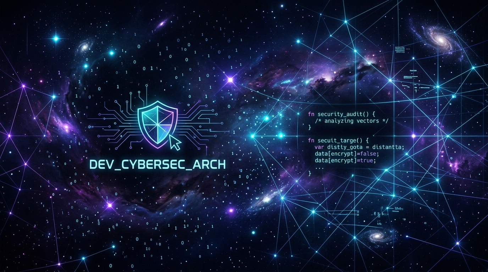

<div align="center">

# 🪐 TALHA ZENGİN 🌌
### *Cybersecurity Enthusiast & Software Developer*

<br/>



<br/><br/>

[](https://git.io/typing-svg)

<p align="center">
  
  
  
</p>

---

</div>

## 🌌 `MISSION_OVERVIEW`

```yaml
Operator: Talha Zengin
Mission_Class: Cybersecurity Analyst & Software Architect
Current_Objective: Building secure, scalable systems & exploring threat landscapes
Cosmic_Coordinates: Turkey
Status: Online & Ready to Collaborate
```

- 🛡️ **Cybersecurity:** Exploring penetration testing, network security, digital forensics, and secure coding practices.
- ⚡ **Software Development:** Crafting clean, robust applications using **C#**, **Java**, and **Python**.
- 🌐 **Web Systems:** Developing modern, interactive interfaces with **JavaScript**, **HTML5**, and **CSS3**.
- 🔭 **Vision:** Bridging the gap between software engineering and proactive cyber defense in the vast cosmos of technology.

<br/>

---

## 🛠️ `ARSENAL & TECH_STACK`

<div align="center">

### 💻 Programming Languages
<p>
  
  
  
  
  
  
</p>

### 🛡️ Cybersecurity & Defensive Ops
<p>
  
  
  
  
  
</p>

### 🧰 Tools & Environments
<p>
  
  
  
  
  
</p>

</div>

<br/>

---

## 📊 `COSMIC_METRICS & STATS`

<div align="center">

<table border="0">
  <tr>
    <td align="center">
      
    </td>
    <td align="center">
      
    </td>
  </tr>
  <tr>
    <td colspan="2" align="center">
      
    </td>
  </tr>
</table>

</div>

<br/>

---

## 🛸 `SHOWCASE_VAULT`

<div align="center">

| Project / Repository | Description | Tech Stack | Status |
| :--- | :--- | :--- | :---: |
| [🌌 **portfolyo**](https://github.com/talhazgnn/portfolyo) | Modern & responsive personal showcase website | `HTML5` `CSS3` `JavaScript` | 🚀 Active |
| 🛡️ **Cybersecurity Lab** | Security research, scripts & penetration testing blueprints | `Python` `Bash` `Kali` | 🛰️ In Orbit |
| ⚡ **Core Development** | Algorithms, console architectures & system tools | `C#` `.NET` `Java` | 🧪 Expanding |

</div>

<br/>

---

## 📡 `TRANSMISSION_CHANNELS`

<div align="center">

<p>
  <a href="https://github.com/talhazgnn">
    
  </a>
  <a href="mailto:talha.zgnn@gmail.com">
    
  </a>
</p>

<br/>

*"In the infinite expanse of cyberspace, defense is an art and code is our starship."* 🚀✨

</div>
