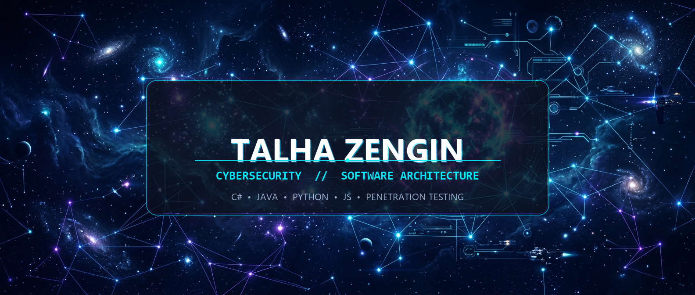

<div align="center">



<br><br>

[](https://git.io/typing-svg)

<p align="center">
  <a href="https://github.com/talhazgnn">
    
  </a>
  <a href="mailto:talha.zgnn@gmail.com">
    
  </a>
  <a href="https://github.com/talhazgnn/portfolyo">
    
  </a>
</p>

</div>

---

### 🚀 `ABOUT ME`

I am a **Software Developer** and **Cybersecurity Enthusiast** based in Turkey, dedicated to engineering resilient software systems and understanding the mechanics of cyber defense.

- 🛡️ **Cybersecurity Focus:** Penetration testing, network protocol analysis, threat modeling, and defensive security.
- 💻 **Engineering Stack:** Designing clean, maintainable backend and system applications in **C#**, **Java**, and **Python**.
- 🌐 **Web Architecture:** Developing fast, responsive user experiences with modern **JavaScript**, **HTML5**, and **CSS3**.
- 🎯 **Continuous Mission:** Bridging the gap between robust software engineering and zero-trust security postures.

<br>

---

### 🛠️ `TECH STACK & ARSENAL`

#### 💻 Core Development & Languages
<div align="left">
  <a href="https://skillicons.dev">
    
  </a>
</div>

<br>

#### 🛡️ Cybersecurity & Systems Toolkit
<div align="left">
  <a href="https://skillicons.dev">
    
  </a>
</div>

<br>

#### 🔍 Security & Network Analysis
<div align="left">
  
  
  
  
</div>

<br>

---

### 📊 `ACTIVITY & METRICS`

<div align="center">

<table border="0" cellspacing="0" cellpadding="0">
  <tr>
    <td align="center" width="50%">
      
    </td>
    <td align="center" width="50%">
      
    </td>
  </tr>
  <tr>
    <td colspan="2" align="center">
      <br>
      
    </td>
  </tr>
</table>

</div>

<br>

---

### 🛸 `FEATURED REPOSITORIES`

<div align="center">

| Project | Description | Stack | Status |
| :--- | :--- | :---: | :---: |
| 🌌 [**`portfolyo`**](https://github.com/talhazgnn/portfolyo) | Modern personal portfolio & interactive showcase platform | `HTML5` `CSS3` `JavaScript` | 🚀 **Live** |
| 🛡️ [**`SecOps-Toolkit`**](#) | Custom security scripts, network scanners & audit utilities | `Python` `Bash` `Kali` | 🛰️ **In Development** |
| ⚡ [**`Core-Architectures`**](#) | High-performance console applications & data algorithms | `C#` `.NET` `Java` | 🧪 **Expanding** |

</div>

<br>

---

<div align="center">

```
"Securing the boundaries of cyberspace, one line of code at a time."
```

<sub>Built with precision by <b>Talha Zengin</b> • 2026</sub>

</div>
